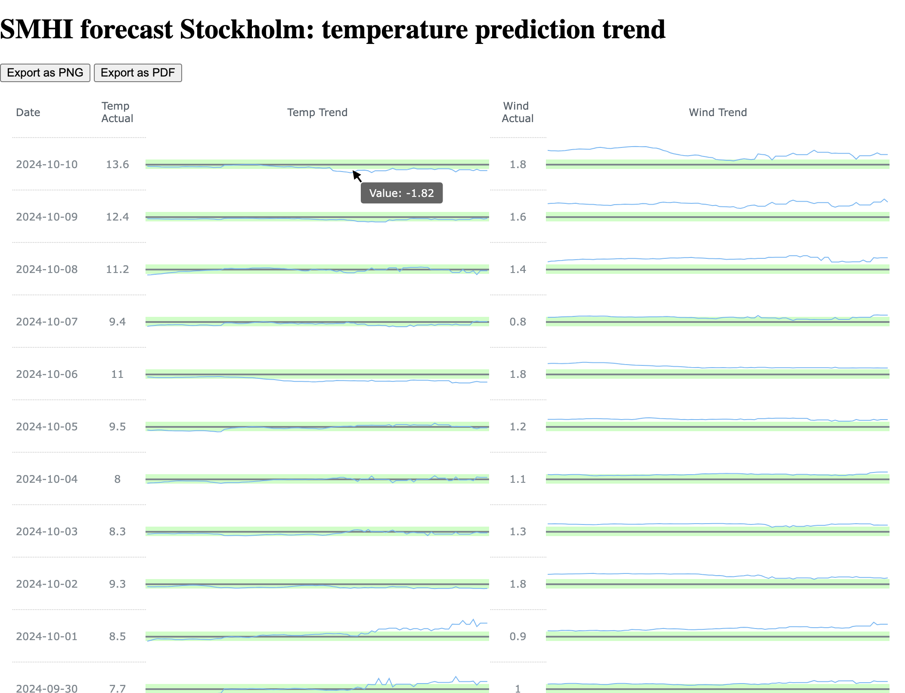

<!-- PROJECT LOGO -->
 

  <h2 align="center">Weather Forecast Evaluation Service</h2>

  

    <a href="https://thinsuu.github.io/forecast-evaluation/">Go to the web service</a>
  

<!-- ABOUT THE PROJECT -->
## About The Project

This project has the objective to analyze the accuracy of the weather forecast prediction over the time and show it in an interactive way.  
The ultimate goal is to be able to compare the quality of the forecast from different weather forecast vendors for all major cities of the world.

The view is built as a live and interactive page per city where a user can trace the error of the prediction over last 100 hours from each of the dates for the temperature and wind.  
For example, on the screenshot above, you can see that, for the point where the pointer is, the temperature was predicted 1.82 degrees lower than it was in the reality on 2023-10-10 (in average for the day), around 60 hours before.  
NB: The forecast time ascends from left to right. The leftmost value is 1 hour before the actual date, the rightmost is 100 hours.

## Details

The service consists of the flow of the data from the forecast website towards the actual GitHub Pages. More precisely, it can be divided into the following steps that are run regularly on [GitHub Actions](https://github.com/Thinsuu/forecast-evaluation/actions):

### Data retrieval and validation

Retrieve the forecast and the historical data by using `requests` library.
The meaning is to collect the data periodically, like once per 30 minutes.

### Initial processing and storing to the database

Filter the new data and put it into the database.  
The data is split to stored into the following categories:

- Historical values: the actual temperature and wind at the specific moment of the time.
- Prediction values: the prediction for moment in the future valid for the moment of data retrieval.
- City names.

Currently, `SQLite` and `PostgreSQL` DBMS are supported.

### Querying the data from the database

Get only relevant data that will take part in the view later. `SQLAlchemy` library is used to work with the DB backend.

### Aggregating the data

Use `Pandas` to aggregate the data queried on the previous step and create a final dataset to be used by the visualization library.  
The data is stored as JSON.

### Preparing the pages to be published

Use template HTML pages and fill them with the relevant city data and connect the plotting tool [`AnyChart`](https://github.com/AnyChart/AnyChart) to the data prepared before. 

### Deploy generated pages and data to Github Pages

Run a publish task in the Github Actions to make the result be visible to the world!

## Roadmap

- [x] Add workable Github Actions
- [ ] Collect data from other websites
- [ ] Do something with the visualization
- [ ] Use `Jinja` for templates
- [ ] Add precipitation to the view
- [ ] Use better aggregation methods (now it is just an average value)

<!-- LICENSE -->
## License

Distributed under the MIT License. See `LICENSE.txt` for more information.
